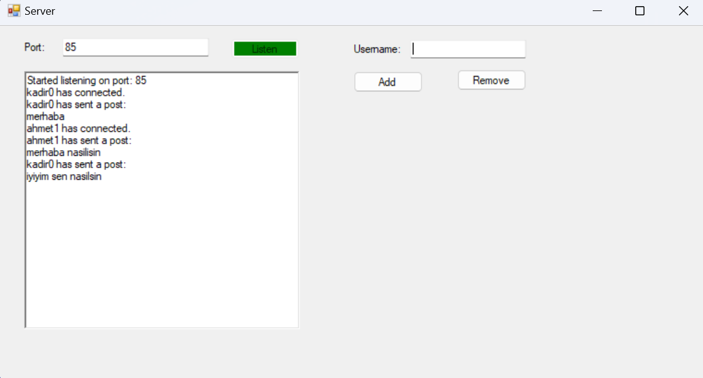
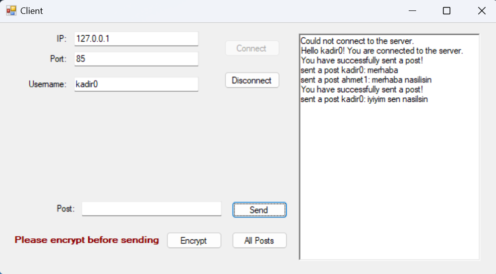

# Server-Client-Chat
Bu proje, C# kullanarak geliştirilen bir server-client iletişim uygulamasını içermektedir. Uygulama, client'lar arasında mesajlaşma sağlamakta, kullanıcı girişlerini bir Microsoft Azure SQL veritabanı üzerinden kontrol etmekte ve mesaj iletiminde Vigenere şifreleme yöntemi kullanmaktadır.

## Özellikler
- **Server-Client İletişimi**: Client tarafından gönderilen mesajlar, server'a bağlı tüm client'ler tarafından görülebilir.
- **Kullanıcı Yönetimi**: Server üzerinden kullanıcı ekleme ve silme özellikleri mevcuttur.
- **Veritabanı Entegrasyonu**: Kullanıcı girişleri SQL veritabanı üzerinden kontrol edilmektedir.
- **Mesaj Şifreleme**: Vigenere şifreleme yöntemi ile mesajlar şifrelenir ve server tarafından çözülerek ekrana yazdırılır.
- **Mesaj Kaydı**: Gelen mesajlar bir metin dosyasında tutulur ve tüm mesajları görme özelliği bulunur.

## Ekran Görüntüleri

### Server

### Client

